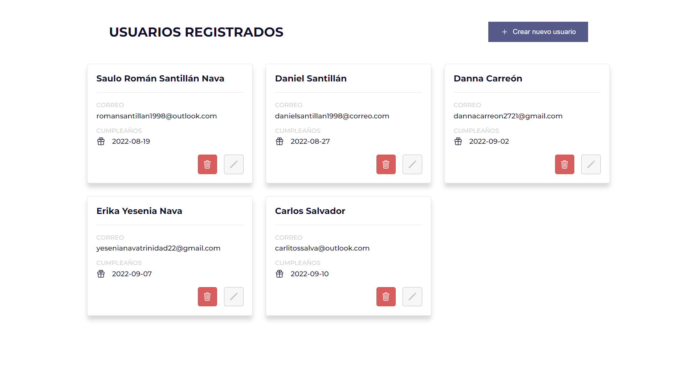
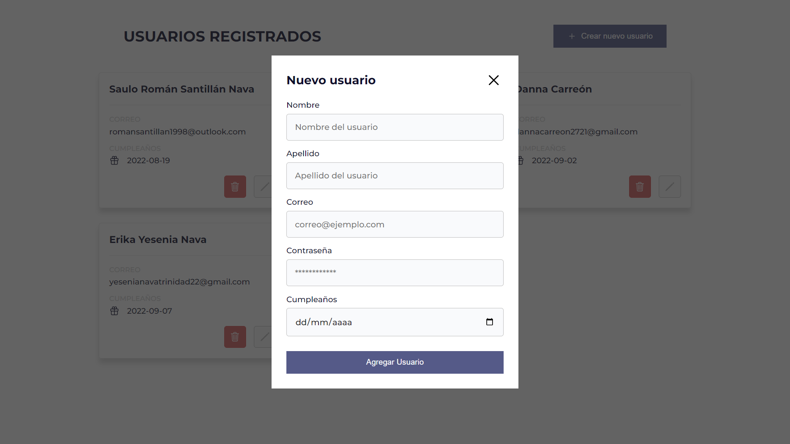
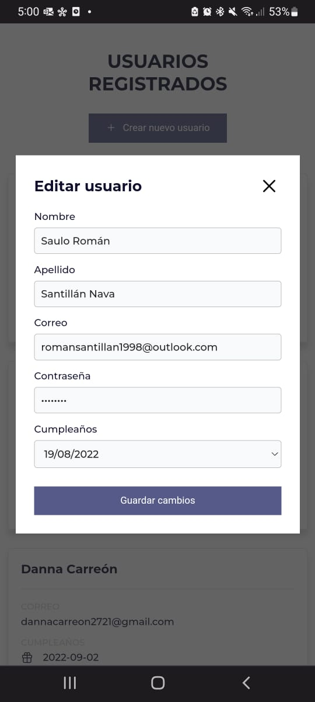

# Users CRUD

As proof of the use of HTTP methods, I developed this responsive web application that allows you to perform the four operations of digital data management: create, read, update and delete.

To achieve this, everything was based on an API that handles user administration. The application has modal windows and a user-friendly graphical interface. 

You can check its functionality on: 

```
https://userscrudroman.netlify.app/
```

<h2>Graphical Interface</h2>
<hr> <br />

<ul>
<li style="display: flex; flex-direction:column; align-items:center; gap:2rem;">
<p>READ - This is where registered users appear. It's the entry point of the application.</p>

</li> <br/>
<li style="display: flex; flex-direction:column; align-items:center; gap:2rem;">
<p>CREATE - If you push the button to add a new user. A modal window will appear with a form where you can type user's information. Each single form in the application has an error management system that doesn't allow to enter invalid input data.</p>

</li> <br/>
<li style="display: flex; flex-direction:column; align-items:center; gap:2rem;">
<p>UPDATE - Each user card has a button to edit the current information. If you push the pen button, a window modal will appear too, but this time with a form that contains the user information to be updated</p>

</li>
</ul>